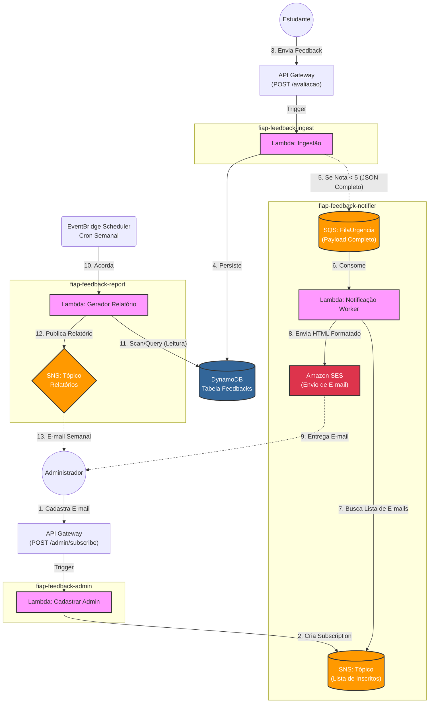

# FIAP Feedback Notifier (Microsserviço 2)

Este repositório contém o microsserviço de **Notificação** da plataforma de Feedback. Ele é responsável por processar feedbacks críticos de forma assíncrona e notificar os administradores via e-mail.

## 📋 Visão Geral

O serviço opera em arquitetura **Serverless** utilizando AWS Lambda e Quarkus. Ele consome mensagens de uma fila SQS (populada pelo serviço de ingestão), verifica o nível de urgência do feedback e envia um e-mail formatado em HTML para os administradores inscritos em um tópico SNS, utilizando o Amazon SES para o envio.

### Arquitetura da Solução



## 🚀 Tecnologias Utilizadas

*   **Java 17**: Linguagem de programação.
*   **Quarkus**: Framework Java Supersônico e Subatômico para microsserviços.
*   **AWS SAM (Serverless Application Model)**: Para IaC (Infraestrutura como Código) e deploy.
*   **AWS Lambda**: Computação serverless.
*   **Amazon SQS**: Fila para desacoplamento e processamento assíncrono.
*   **Amazon SNS**: Gerenciamento de lista de inscritos (Admins).
*   **Amazon SES**: Serviço de envio de e-mails transacionais.

## ⚙️ Pré-requisitos

*   Java 17 instalado.
*   Maven instalado.
*   AWS CLI configurado com suas credenciais.
*   AWS SAM CLI instalado.
*   Docker (opcional, para testes locais).

## 📦 Como Fazer o Deploy

1.  **Compile o projeto:**
```bash
.\mvnw.cmd clean package -DskipTests
```

2.  **Execute o deploy guiado com base no `samconfig.toml` já existente:**
```bash
sam deploy
```

> **Importante:** Durante o deploy, altere o email do remetente `email-empresa-notificacoes@gmail.com` no `template.yaml`. Insira um e-mail válido que você tenha acesso.

3.  **Verificação de E-mail (AWS SES Sandbox):**
Se a conta AWS estiver em modo Sandbox (padrão para contas novas), você receberá um e-mail da AWS no endereço informado (`SenderEmail`). **Você deve clicar no link de verificação** para permitir que a aplicação envie e-mails usando este endereço. Veja a seção de Troubleshooting. Como estamos utilizando Sandbox tanto o remetente quanto o destinatário devem estar verificados.


4. **Para deletar os serviços criados da AWS**
```bash
sam delete --stack-name fiap-feedback-notifier
```


## 🧪 Como Testar

### Exemplos de Payload (JSON)

#### Envio de Feedback de Urgência (SQS)

Este serviço consome mensagens de uma fila SQS. Portanto, para testá-lo, você deve enviar uma mensagem para a fila `FilaUrgencia` com o seguinte payload:

```json
{
  "id": "1001",
  "descricao": "A aula de Deploy Automatizado está com o áudio corrompido. Preciso entregar o desafio amanhã. Por favor, verifiquem urgente!",
  "nota": 1,
  "dataCriacao": "2025-12-14T20:00:00"
}
```

#### Envio de Relatório (SNS)
Este serviço consome mensagens publicadas em um tópico SNS. Portanto, para testá-lo, você deve publicar uma mensagem no tópico `ReportTopic` com o seguinte payload:

```json
{
"subject": "Relatório dos Feedbacks de Urgências - 22/12/2025",
"body": "<h3>Relatório consolidado com os feedbacks de urgências enviados durante a semana do dia 22/12/2025 à 26/12/2025.</h3> <br><p>Principais tópicos:</p> <ul><li>Sugestão de disponibilização de material complementar (vídeo atualizado, transcrição ou slides detalhados)</li><li>Dificuldade de acompanhamento do conteúdo e necessidade de rever a aula</li><li>Impactos nos prazos de entrega dos desafios devido às falhas de áudio</li></ul>",
"s3Url": "https://url-do-s3-do-pdf/relatorioDeUrgencia2025-12-24.pdf"
}
```

> **Importante:** Para testar também será necessário ter esse arquivo no S3. Caso não tenha utilizado o MS3 (Microsserviço 3) para gerá-lo.

## ⚠️ Troubleshooting (AWS SES)

**Erro:** `Email address is not verified`

Se você vir este erro nos logs, significa que o remetente ou o destinatário não foram verificados no Amazon SES.

1.  Acesse o console da AWS > **Amazon SES**.
2.  Vá em **Verified Identities**.
3.  Certifique-se de que tanto o e-mail definido em `SenderEmail` quanto o e-mail do administrador (inscrito no SNS) estejam com status **Verified**.
4.  Se não estiverem, clique em "Create Identity", adicione o e-mail e clique no link de confirmação enviado para a caixa de entrada.

---
**Desenvolvido para o Tech Challenge da FIAP - Fase de Cloud Computing & Serverless.**
