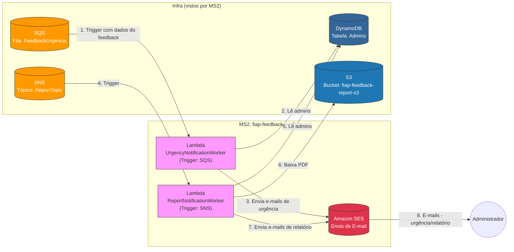

# FIAP Feedback Notifier (Microsserviço 2)

Este repositório contém o microsserviço de **Notificação** da plataforma de Feedback. Ele é responsável por processar feedbacks críticos de forma assíncrona e notificar os administradores via e-mail.

## 📋 Visão Geral

O serviço opera em arquitetura **Serverless** utilizando AWS Lambda e Quarkus. Ele consome mensagens de uma fila SQS (populada pelo serviço de ingestão - MS1), verifica o nível de urgência do feedback e notifica os administradores cadastrados via e-mail formatado em HTML. Adicionalmente, o serviço é responsável pela distribuição de relatórios semanais: ao receber um gatilho via SNS, ele envia o relatório consolidado por e-mail para a mesma lista de administradores.

### Arquitetura da Solução


```mermaid
flowchart LR
    Admin((Administrador))

    subgraph MS2["MS2: fiap-feedback-notifier"]
        Lambda_UrgencyNotifier["Lambda<br/>UrgencyNotificationWorker<br/>(Trigger: SQS)"]
        Lambda_ReportNotifier["Lambda<br/>ReportNotificationWorker<br/>(Trigger: SNS)"]
        SES[("Amazon SES<br/>Envio de E‑mail")]
    end

    subgraph Infra["Infra (vistos por MS2)"]
        SQS_Urgency[("SQS<br/>Fila: FeedbackUrgencia")]
        SNS_Reports[("SNS<br/>Tópico: ReportTopic")]
        DB_Admins[("DynamoDB<br/>Tabela: Admins")]
        S3_Reports[("S3<br/>Bucket: fiap-feedback-report-s3")]
    end

%% Fluxo de Urgência Corrigido
    SQS_Urgency -->|1. Trigger com dados do feedback| Lambda_UrgencyNotifier
    Lambda_UrgencyNotifier -->|2. Lê admins| DB_Admins
    Lambda_UrgencyNotifier -->|3. Envia e‑mails de urgência| SES

%% Fluxo de Relatórios
    SNS_Reports -->|4. Trigger| Lambda_ReportNotifier
    Lambda_ReportNotifier -->|5. Lê admins| DB_Admins
    Lambda_ReportNotifier -->|6. Baixa PDF| S3_Reports
    Lambda_ReportNotifier -->|7. Envia e‑mails de relatório| SES

    SES -->|8. E‑mails - urgência/relatório| Admin

    classDef lambda fill:#f9f,stroke:#333,stroke-width:1px;
    classDef db fill:#336699,stroke:#333,stroke-width:1px,color:#fff;
    classDef queue fill:#ff9900,stroke:#333,stroke-width:1px,color:#fff;
    classDef s3 fill:#1f77b4,stroke:#333,stroke-width:1px,color:#fff;
    classDef ses fill:#DD344C,stroke:#333,stroke-width:1px,color:#fff;
    classDef sns fill:#ff9900,stroke:#333,stroke-width:1px,color:#fff;

    class Lambda_UrgencyNotifier,Lambda_ReportNotifier lambda;
    class SQS_Urgency queue;
    class SNS_Reports sns;
    class DB,DB_Admins db;
    class S3_Reports s3;
    class SES ses;
```

## 📦 Como Fazer o Deploy

1.  **Compile o projeto:**
```bash
.\mvnw.cmd clean package -DskipTests
```

2.  **Execute o deploy guiado com base no `samconfig.toml` já existente:**
```bash
sam deploy
```

> **Importante:** Durante o deploy, altere o email do remetente `email-empresa-notificacoes@gmail.com` no `template.yaml`. Insira um e-mail válido que você tenha acesso.

3.  **Verificação de E-mail (AWS SES Sandbox):**
Se a conta AWS estiver em modo Sandbox (padrão para contas novas), você receberá um e-mail da AWS no endereço informado (`SenderEmail`). **Você deve clicar no link de verificação** para permitir que a aplicação envie e-mails usando este endereço. Veja a seção de Troubleshooting. Como estamos utilizando Sandbox tanto o remetente quanto o destinatário devem estar verificados.


4. **Para deletar os serviços criados da AWS**
```bash
sam delete --stack-name fiap-feedback-notifier
```


## 🧪 Como Testar

### Exemplos de Payload (JSON)

#### Envio de Feedback de Urgência (SQS)

Este serviço consome mensagens de uma fila SQS. Portanto, para testá-lo, você deve enviar uma mensagem para a fila `FilaUrgencia` com o seguinte payload:

```json
{
  "id": "1001",
  "descricao": "A aula de Deploy Automatizado está com o áudio corrompido. Preciso entregar o desafio amanhã. Por favor, verifiquem urgente!",
  "nota": 1,
  "dataCriacao": "2025-12-14T20:00:00"
}
```

#### Envio de Relatório (SNS)
Este serviço consome mensagens publicadas em um tópico SNS. Portanto, para testá-lo, você deve publicar uma mensagem no tópico `ReportTopic` com o seguinte payload:

```json
{
"subject": "Relatório dos Feedbacks de Urgências - 22/12/2025",
"body": "<h3>Relatório consolidado com os feedbacks de urgências enviados durante a semana do dia 22/12/2025 à 26/12/2025.</h3> <br><p>Principais tópicos:</p> <ul><li>Sugestão de disponibilização de material complementar (vídeo atualizado, transcrição ou slides detalhados)</li><li>Dificuldade de acompanhamento do conteúdo e necessidade de rever a aula</li><li>Impactos nos prazos de entrega dos desafios devido às falhas de áudio</li></ul>",
"s3Url": "https://url-do-s3-do-pdf/relatorioDeUrgencia2025-12-24.pdf"
}
```

> **Importante:** Para testar também será necessário ter esse arquivo no S3. Caso não tenha utilizado o MS3 (Microsserviço 3) para gerá-lo.

## ⚠️ Troubleshooting (AWS SES)

**Erro:** `Email address is not verified`

Se você vir este erro nos logs, significa que o remetente ou o destinatário não foram verificados no Amazon SES.

1.  Acesse o console da AWS > **Amazon SES**.
2.  Vá em **Verified Identities**.
3.  Certifique-se de que tanto o e-mail definido em `SenderEmail` quanto o e-mail do administrador (inscrito no SNS) estejam com status **Verified**.
4.  Se não estiverem, clique em "Create Identity", adicione o e-mail e clique no link de confirmação enviado para a caixa de entrada.

---
**Desenvolvido para o Tech Challenge da FIAP - Fase de Cloud Computing & Serverless.**
